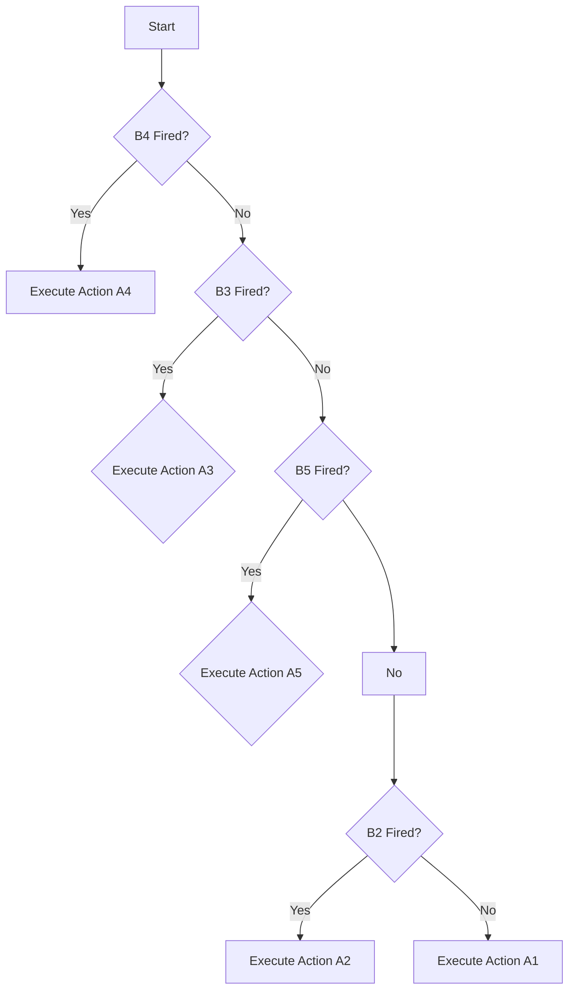

# cmd-protocol-v3

Documentation and reference implementation of command protocol v3, which adds mapping between trigger events and actions

## Trigger type

A trigger type can be a button that can be triggered by several modalities:

1. single-click
2. double-click
3. triple-click
4. long-press
5. combination of triggers 1-4 of the same button or another one.

All triggers can have a timeout value, which resets the current state and starts evaluating a trigger type from the beginning.

## Example Configuration

```python
    a1 = Action(name="single-click action")
    a2 = Action(name="double-click action")
    a3 = Action(name="triple-click action")
    a4 = Action(name="long press action")
    a5 = Action(name="combined action")

    # Button 1, single-click
    b1=Button(name="b1",source=1,mode="pressed",count=1, timeout=400,action=a1)
    # Button 1, double-click
    b2 = Button(name="b2",source=1, mode="pressed", count=2, timeout=400, action=a2)
    # Button 1, triple-click
    b3 = Button(name="b3",source=1, mode="pressed", count=3, timeout=400, action=a3)
    # Button 1, long press
    b4 = Button(name="b4", source=1, mode="long_pressed", count=1, timeout=600, duration=100, action=a4)
    # Button 1 single-click + Button 2 single-click
    b5 = Button(name="b5", source=1, mode="pressed", count=1, timeout=200,
                next_trigger=Button(name="b5a", source=2, mode="pressed", count=1, timeout=200, action=a5)
```
## Algorithm

The trigger mappings must be grouped by trigger_type (e.g. button and source number) and then sorted by priority within that group.

### Example

1. Button 1, long press
2. Button 1, triple-click
3. Button 1, single-click + Button 2, single-click
4. Button 1, double-click
5. Button 1, single-click

```python
   trigger_defs=[b4,b3,b5,b2,b1]
```

### Evaluation

A button press is then propagated to all trigger mappings and the action is executed depending according to the following flowchart:


